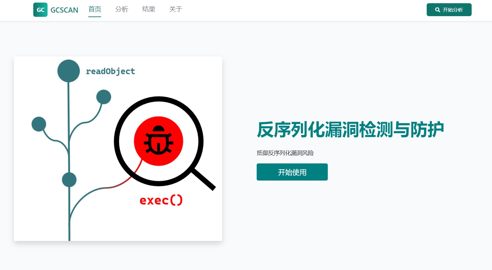
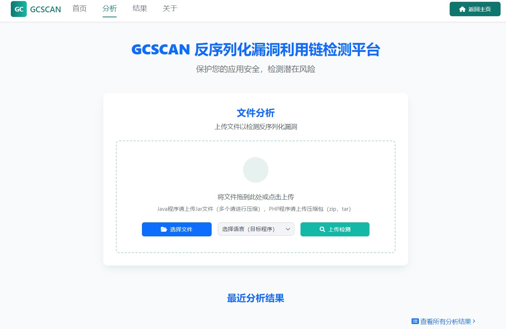
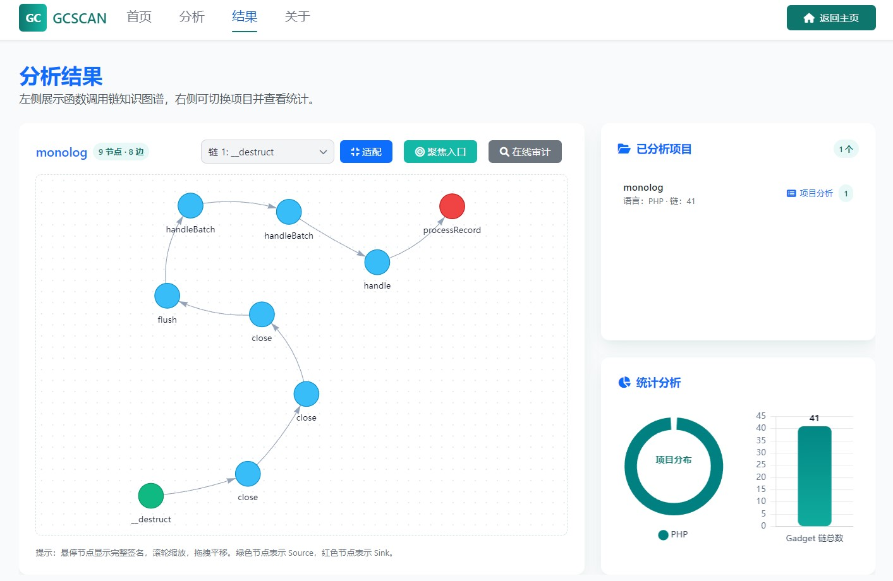

## DeserAnalyzer
### 环境依赖
- Java：17
- 使用git lfs下载jadx依赖

### 效果预览
主页效果如图

分析页面效果如图

结果页面效果如图

本系统还支持在线代码审计，及AI辅助审计

### 论文支撑
本系统基于如下的Gadget Chain检测工具进行开发：
- PFortifier: Mitigating PHP Object Injection Through Automatic Patch Generation，发表于2025 IEEE Symposium on Security and Privacy (SP)
- Precise and effective gadget chain mining through deserialization guided call graph construction，发表于Proceedings of the 34th USENIX Conference on Security Symposium